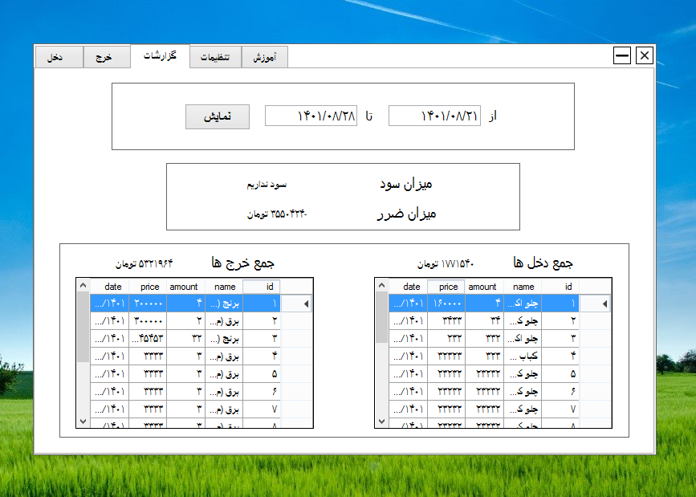
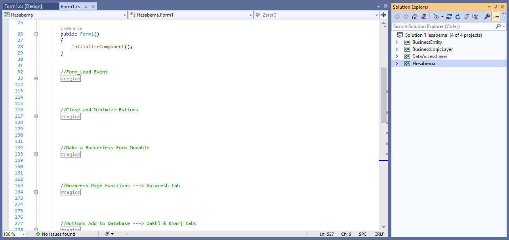

# RTL-Accounting-Software

A complete right-to-left accounting software developed by [Amin Aghakazemi](https://aminakazemi.info) using .NET Framework and the C# language.

## Introduction

Welcome to the RTL Accounting repository.

RTL Accounting Software is a finance management Windows application tailored for small businesses, designed to handle specific spending and income transactions effectively. 

Small businesses can easily define their specific income and expenditure items, and then add each purchase or sale made within their business.

  

Adding each sale made within the business is as simple as shown in the screenshot below.

  

And adding each purchase (expenditure) is as simple as the screenshot below.

  

There's also an analytics section available to review totals and other relevant data.

  

And there's a 'Documentation' section where developers can include any educational content they wish to add.

  

The project includes clean and structured code, built within the Three-Layer Architecture. This architecture divides the application into three logical layers:

- Presentation Layer: Handles user interaction and interface.
- Business Logic Layer: Manages business rules and logic.
- Data Access Layer: Handles data storage and retrieval.

This separation enhances maintainability, scalability, and code reusability, ensuring a streamlined development process and a robust foundation for your application.

  

## Installation

To get started with the app, follow these simple steps:

1. Download the repository as a ZIP file.
2. Extract the ZIP file (rtlAccounting.zip).
3. Open the project in your preferred code editor, such as Visual Studio.
4. Check the dependencies and ensure that you have .NET Framework 4.7.2, Entity Framework 6.4.4, SQL Server, SSMS, etc., installed.
5. Clean the entire solution and rebuild it.
6. Run the project. It should execute and function correctly. In case of any basic errors on your device or IDE, troubleshoot and fix them before running the project again.

## License

This project is licensed under the **MIT License**. For more details, please see the [LICENSE](https://github.com/Amin-Aghakazemi/RTL-Accounting-Software/blob/main/LICENSE) file.
